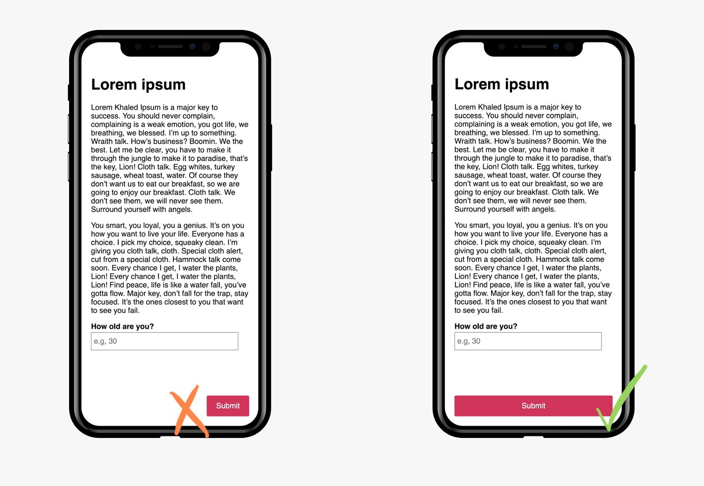
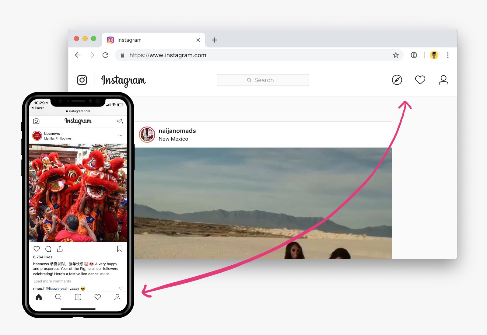
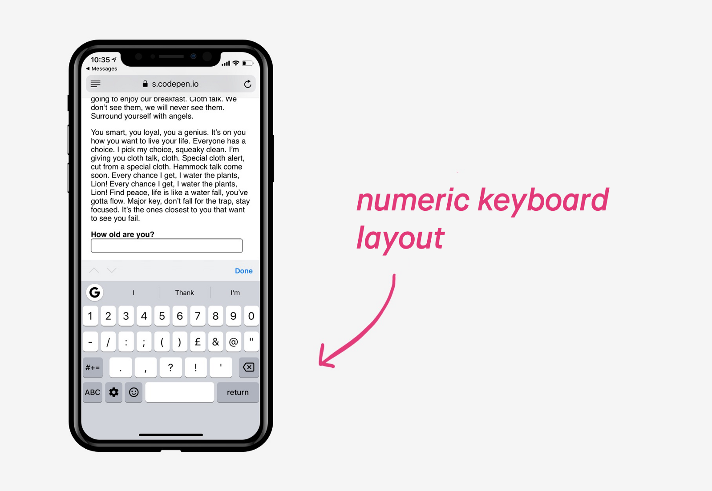

_Перевод «[Tips for making interactive elements accessible on mobile devices](https://bitsofco.de/tips-for-making-interactive-elements-accessible-on-mobile-devices/)» Ире Адеринокун._

<figure>
    
	<figcaption><a href="https://dribbble.com/shots/5404310-Responsive-Screens">Responsive Screens</a> by <a href="https://dribbble.com/grateful_meg">Meagan Fraser</a></figcaption>
</figure>

[Web Content Accessibility Guidelines](https://www.w3.org/TR/WCAG21/) (WCAG) — это набор правил для создания доступных сайтов. Вторая версия была опубликована в 2008 году, еще перед тем, как стало возможно просматривать сайты на мобильных устройствах.

Несколько лет назад WCAG был обновлён до версии 2.1, в которую был включен совершенно новый раздел [с правилами доступности для мобильных устройств](https://www.w3.org/TR/mobile-accessibility-mapping/). Среди них есть несколько правил, актуальных только для мобильных. Например, [правило 1.3.4](https://www.w3.org/TR/WCAG21/#orientation), которое гласит: контент не должен ограничивать свою читаемость и работоспособность только одной ориентацией экрана, такой, как книжная или альбомная, если только определённая ориентация не обоснована.

В этой статье я расскажу о некоторых новых рекомендациях, касающихся интерактивных элементов на странице.

### Располагайте интерактивные элементы там, где к ним легко получить доступ

Первое, что следует учитывать при разработке сайта под мобильные устройства — это размещение интерактивных или активных элементов. По сравнению с ограниченными способами взаимодействия с десктопными устройствами, мобильными девайсами мы можем пользоваться очень по-разному — одной рукой, двумя руками, только левой или только правой и т.д.

Из-за подобного разнообразия способов взаимодействия рекомендуется создавать гибкие интерфейсы. Например, вы скорее всего подумаете, что расположить интерактивный элемент лучше всего в правом нижнем углу, поскольку большинство людей работают на мобильном правой рукой. И тем не менее это самое неудачное место на экране, если пользоваться мобильным левой рукой. Наилучшим решением в данной ситуации будет сделать элемент на всю ширину экрана.

## Дайте понять, что с элементом можно взаимодействовать

Опять же, показать на тач-экранах что элемент интерактивен, может стать той ещё задачкой, по сравнению с десктопными устройствами. Без ховеров мы должны одним только внешним видом показать пользователю, что с элементом можно взаимодействовать.

Лучший способ показать, что с элементом можно взаимодействовать — придерживаться негласного соглашения о том, как должны выглядеть подобные элементы. Например, [ссылки](https://bitsofco.de/tips-for-making-interactive-elements-accessible-on-mobile-devices/) обычно подчёркнуты или имеют цвет, отличный от цвета текста на всей странице. А кнопки соцсетей обычно квадратной формы с закруглёнными краями.

Мы также можем использовать расположение элементов, чтобы дать понять, что они доступны для какого-либо действия. Навигация, например, обычно располагается сверху. Для мобильных устройств также вполне допустимо расположить навигацию внизу окна.

## Дайте инструкции к доступным кастомным жестам

Так же, как и в предыдущем случае, очень важно давать чёткие инструкции по кастомным жестам именно на устройствах с тач-экраном.

Хорошим примером для этого служит жест «потянуть чтобы обновить». Если нет никаких признаков того, что этот жест доступен, пользователь никогда им не воспользуется. В мобильной версии Твиттера есть иконка, указывающая, что можно потянуть страницу для обновления ленты. Она появляется, когда пользователь скроллит страницу вверх.

<figure>
    
    
    
	<figcaption>При прокручивании вверх страницы профиля в мобильном Твиттере, появляется иконка «потянуть чтобы обновить»</figcaption>
</figure>

## Обеспечьте разумные размер и положение интерактивной цели

На устройствах с тач-экраном курсором является палец пользователя. Конечно, из-за этого точность касания гораздо ниже, нежели при работе с мышкой. Следовательно, область, на которую может тапнуть пользователь, должна быть достаточно большой для пальцев разного размера.

Согласно [правилу 2.5.5](https://www.w3.org/TR/WCAG21/#target-size), интерактивные элементы должны иметь размер не меньше чем 44×44 пикселя, за исключением случаев, когда цель встроена в блок текста.

## Группируйте элементы, выполняющие одно и то же действие

Этот совет лучше всего проиллюстрировать следующим примером. Предположим, что у нас есть ссылка, ведущая на главную страницу сайта и, помимо этого, у нас также есть иконка домашней страницы. По различным причинам мы можем захотеть разделить эти два элемента и в итоге получим две ссылки, ведущие в одно и то же место.

    <!-- Не рекомендуется -->

    
    <a href="/">Главная</a>

У этого метода два основных недостатка:

1. Уменьшается размер области касания, поскольку промежуток между ссылками не будет активным.
2. Увеличивается количество элементов, по которым придётся проходить пользователю при навигации с клавиатуры. Если перемещаться по странице при помощи таба, то подобное дублирование может утомить.

Лучшим решением будет сгруппировать оба элемента в одну ссылку:

    <!-- Так гораздо лучше! -->

    <a href="/">
        
        Главная
    </a>

Это не только увеличит область касания для ссылки, но и уменьшит количество ссылок, по которым придётся проходить при навигации с клавиатуры.

## Упростите набор текста с помощью специальных раскладок клавиатуры

Одна из главных проблем устройств с тач-экранами — набор текста с экранной клавиатуры. Мы можем упростить этот момент, предоставляя специальные клавиатуры в зависимости от типа вводимых данных.

Например, если нужно вводить цифры, то мы можем показать клавиатуру с цифрами, указав нужное значение атрибута `type` у элемента `<input>`.

    <label>
        Сколько вам лет?
        <input type="number">
    </label>

В некоторых случаях мы должны указать определённое значение атрибута `type` у элемента `<input>`, например, `text`, хотя всё ещё ожидаем от пользователя ввода цифр. В этой ситуации на помощь приходит атрибут `inputmode`, который позволяет указать, какую именно клавиатуру показать пользователю, вне зависимости от значения атрибута `type`.

    <label>
        Сколько вам лет?
        <input type="text" inputmode="numeric">
    </label>

На момент написания статьи атрибут `inputmode` [имеет не очень хорошую поддержку](https://caniuse.com/#feat=input-inputmode).

## Предоставьте альтернативу набору текста

Ещё один способ решить проблему с набором текста на тач-устройствах — уменьшить количество ситуаций, в которых требуется ввод текста.

Вообще, на мобильных устройствах проще работать с чекбоксами, радиокнопками и выпадающими списками, чем с полями для ввода текста.

В тех местах, где требуется ввод текста, мы можем постараться автоматически заполнять поля. Например, подставляя текущую локацию в поле адреса.

_Перевод [Алёны Батицкой](https://medium.com/@ABatickaya), редактура [Натальи Рыжовой](https://www.facebook.com/natalia.ryzhova.71) и [Вадима Макеева](https://medium.com/@pepelsbey)._
