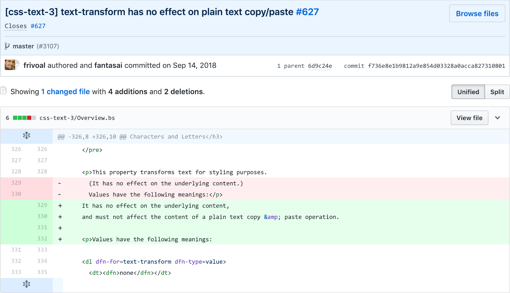

Что происходит при копировании текста с `text-transform`.

В CSS есть свойство [`text-transform`](https://developer.mozilla.org/en-US/docs/Web/CSS/text-transform). С помощью него можно менять регистр текста: можно преобразовать текст в ПРОПИСНЫЕ, строчные или Капитализировать Только Первые Буквы Слов. Это делается значениями `uppercase`, `lowercase` и `capitalize`, соответственно. Помимо них есть значения `full-width` и `full-size-kana`, про которые мы в этот раз говорить не будем.

Пример текста с <code>text-transform: uppercase</code>

Пример текста с <code>text-transform: lowercase</code>

Пример текста с <code>text-transform: capitalize</code>

Выше приведен пример использования свойства `text-transform`. Попробуйте скопировать любой из них и вставить куда-нибудь. Результат будет отличаться в зависимости от вашего браузера:

- Если у вас браузер на WebKit или Blink (Chrome, Safari, Opera 15+, Яндекс.Браузер и вскоре даже Edge), то вставится измененный текст — тот, который вы видите в браузере.
- В остальных браузерах (Firefox, IE и пока Edge) вставится исходный текст — тот, который написан в HTML.

Стандарт до недавнего времени не определял, какое поведение является верным, поэтому оно стало предметом споров в баг-трекерах. [Баг для Firefox](https://bugzilla.mozilla.org/show_bug.cgi?id=35148) завели еще в 2000 году, [баг для WebKit](https://bugs.webkit.org/show_bug.cgi?id=43202) с противоположным смыслом — в 2010. У сторонников обоих вариантов есть аргументы.

Главный аргумент за копирование измененного текста, как в WebKit — соответствие ожиданиям пользователя. Человек не может понять, в результате чего текст отображается заглавными буквами. Может быть, он прописан таким образом в исходном коде, а может быть, к нему применено `text-trasform: uppercase`. Если пользователь будет копировать текст в верхнем регистре, а потом вставлять его и иногда видеть что-то другое, ему будет казаться, что веб сломался и глючит.

Аргумент другой стороны в том, что такое поведение нарушает принцип разделения содержимого и оформления. CSS не должен влиять на контент страницы. А раз создатели сайта решили менять регистр через CSS, то они относятся к этому как к стилизации, и у пользователя должен быть доступ к изначальному варианту текста.

[В 2016 году](https://github.com/w3c/csswg-drafts/issues/627) за этот вопрос взялась Рабочая группа CSS (CSSWG). При обсуждении [выделили](https://github.com/w3c/csswg-drafts/issues/627#issuecomment-255279958) основные сценарии использования `text-transform`:

- `p::first-line { text-transform: uppercase }` — первую строку набирают прописными буквами, как это иногда делают в англоязычной художественной литературе. В этом случае лучше копировать исходный текст, иначе он будет выглядеть странно.
- `abbr { text-transform: lowercase; font-variant: small-caps }` — аббревиатуры в тексте набирают капителью. Свойство `font-variant: small-caps` берёт специальное начертание для капители из шрифта или отображает строчные буквы как прописные, только уменьшенного размера, если их нет. В этом случае тоже лучше копировать исходный текст, иначе аббревиатуры будут набраны строчными буквами.
- `h1 { text-transform: uppercase }` — стилизуют заголовки с помощью прописных букв. Здесь применимы аргументы за оба варианта поведения.
- `em { font-style: normal; text-transform: uppercase }` — используют прописные буквы для выделения важных фрагментов. Здесь тоже применимы оба аргумента.

В результате обсуждений в рабочей группе, в 2018 году было принято решение: [дополнить стандарт CSS](https://github.com/w3c/csswg-drafts/commit/f736e8e1b9812a9e854d03328a0acca827310801) указанием, что свойство `text-transform` не должно влиять на копируемый текст.

_Коммит, который вносит изменения в стандарт._

Сейчас баг в Firefox закрыт как «wontfix», баг в WebKit по-прежнему открыт. Но уже можно надеяться, что скоро его поправят, и копирование текста с `text-transform` начнет работать во всех браузерах одинаково.
